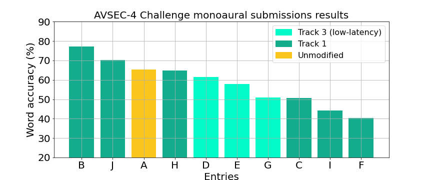
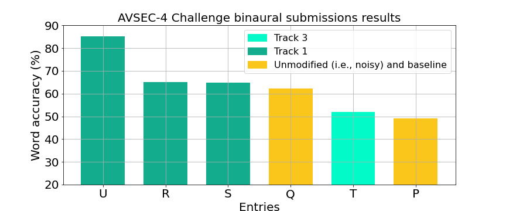

# AVSEC-4 Challenge 2025 results

**AVSEC-4 listening test results are out!**

We thank all participants for taking part in the Challenge.
Further information will be shared in the [AVSEC-4 workshop.](getting-started/avsec4-workshop.md)

We thank all participants for taking part in the challenge and congratulate the winning teams!
We thank our industry partner, Sonova, for sponsoring the Challenge.

### Monoaural submissions:
- 1st place:   
Rong Chao   
Academia Sinica, National Taiwan University 

- 2nd place:   
Aquib Raza   
National Taiwan University

### Binaural submissions:
- 1st place:   
Zhan Jin   
Wuhan University & Duke Kunshan University, China

- 2nd place:   
Wenze Ren   
National Taiwan University

### Low-latency track:
- 1st place:   
Rahma Fourati   
ReGIM-Lab, University of Sfax, Tunisia

Listening test design:

We conducted two separate listening tests; one for monoaural submissions and another for binaural submissions. 
Participants taking part in the listening test were assigned to either the monoaural or to the binaural test. 

In each test (i.e., monoaural and binaural), we evaluated the same video clips. Participants saw 126 video clips; 120 samples plus 6 validation questions.

# Monoaural submissions

| System name | Letter | **Overall** | **Speech & Noise** | **Speech & Speech** | **Speech & Music** |
|-------------|--------|-------------|--------------------|---------------------|--------------------|
| Unmodified  | A      | 65.20       | 63.60              | 68.86               | 63.16              |     
| CITISIN     | B      | 77.19       | 82.46              | 76.75               | 72.37              |       
| ENU-Try1    | C      | 50.58       | 55.70              | 45.61               | 50.44              |       
| RahmaTeam   | D      | 61.55       | 60.09              | 62.28               | 62.28              |                                              
| Recogna     | E      | 57.75       | 61.40              | 53.07               | 58.77              |                       
| TREND       | F      | 40.35       | 36.84              | 42.11               | 42.11              |                     
| USTC_Entry1 | G      | 50.88       | 53.95              | 48.68               | 50.00              |                           
| Bio-ASP     | H      | 64.77       | 71.49              | 58.77               | 64.04              |                            
| Team-OPTIMAL| I      | 44.30       | 37.72              | 47.81               | 47.37              |                            
| EnhanceTech | J      | 70.18       | 77.63              | 65.35               | 67.54              |                            
|             | LSD    | 4.65        | 6.73               | 7.76                | 7.42               |  

  

Word intelligibility scores (%) calculated across all conditions (Overall), per interferer combination: Speech & Noise, Speech & Speech and Speech & Music. A higher score means more intelligible. 
Scores were calculated as the percentage of words correctly identified, computed for each participant and averaged across 60 participants. Differences larger than the Fisher's least significant difference (LSD) are significant. System A corresponds to the noisy mixes (i.e.  non-enhanced).}

# Binaural submissions
| System name | Letter | **Overall** | **Speech & Noise** | **Speech & Speech** | **Speech & Music** |
|-------------|--------|-------------|--------------------|---------------------|--------------------|
| Baseline    | P      | 48.98       | 52.63              | 48.68               | 45.61              |     
| Unmodified  | Q      | 62.28       | 62.28              | 63.16               | 61.40              |       
| TNP         | R      | 65.03       | 63.84              | 73.21               | 58.04              |       
| Media NTU   | S      | 64.73       | 58.48              | 70.98               | 64.73              |
| WHU DKU     | U      | 85.23       | 87.28              | 89.04               | 79.39              |                     
|             | LSD    | 5.29        | 7.97               | 7.53                | 7.60               |  

[//]: # (| TBA         | T      | 51.90       | 56.14              | 50.88               | 48.68              |                       )

  

[//]: # (Word intelligibility scores &#40;%&#41; calculated across all conditions &#40;Overall&#41;, per interferer combination: Speech & Noise, Speech & Speech and Speech & Music. A higher score means more intelligible. )
Scores were calculated as the percentage of words correctly identified, computed for each participant and averaged across 36 participants. Differences larger than the Fisher's least significant difference (LSD) are significant. System Q corresponds to the noisy mixes (i.e. non-enhanced) and system P to the binaural baseline.

# One page system descriptions:  

**Monoaural submissions**
- [BioASP](https://challenge.cogmhear.org/submissions/avsec4_2025/Bio-ASP.pdf)
- [EnhanceTech](https://challenge.cogmhear.org/submissions/avsec4_2025/EnhanceTech.pdf)
- [TREND](https://challenge.cogmhear.org/submissions/avsec4_2025/TREND.pdf)
- [RahmaTeam](https://challenge.cogmhear.org/submissions/avsec4_2025/RahmaTeam.pdf)
- [CITISIN](https://challenge.cogmhear.org/submissions/avsec4_2025/CITISIN.pdf)
- [Recogna](https://challenge.cogmhear.org/submissions/avsec4_2025/Recogna.pdf)
- [ENU-Try1](https://challenge.cogmhear.org/submissions/avsec4_2025/ENU-TRY1.pdf)
- [USTC_Entry1](https://challenge.cogmhear.org/submissions/avsec4_2025/USTC_Entry1.pdf)
- [TeamOPTIMAL](https://challenge.cogmhear.org/submissions/avsec4_2025/TeamOPTIMAL.pdf)

**Binaural submissions**
- [Media_NTU](https://challenge.cogmhear.org/submissions/avsec4_2025/Media_NTU.pdf)
- [ENU-GU](https://challenge.cogmhear.org/submissions/avsec4_2025/ENU-GU.pdf)
- [TNP](https://challenge.cogmhear.org/submissions/avsec4_2025/TNP.pdf)
- [WHU_DKU](https://challenge.cogmhear.org/submissions/avsec4_2025/WHU_DKU.pdf)

# Results of previous editions: 

- Results from the 1st edition can be found [here](/avsec1/results.md).
- Results from the 2nd edition can be found [here](/avsec2/results.md). 
- Results from the 3rd edition can be found [here](/avsec3/results.md).